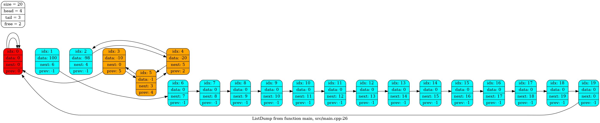

# List
Doubly-linked list implementation based on arrays.

## Supported features
1. Insertion value to any place of the list.
2. Dynamic internal data storage reallocation.
3. Deletion from any place of the list.

## Usage
1. `git clone https://github.com/victorbaldin56/List`
2. `make`
3. Then please generate docs with `doxygen Doxyfile` and read the output
carefully to avoid possible mistakes in usage.
4. `make run`
